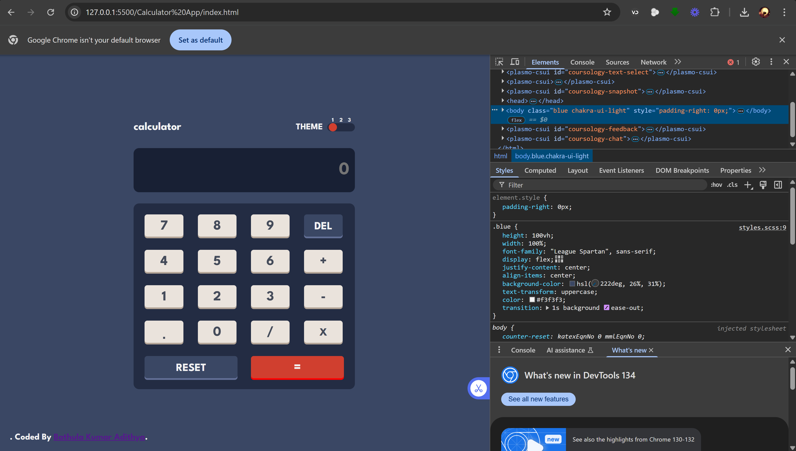
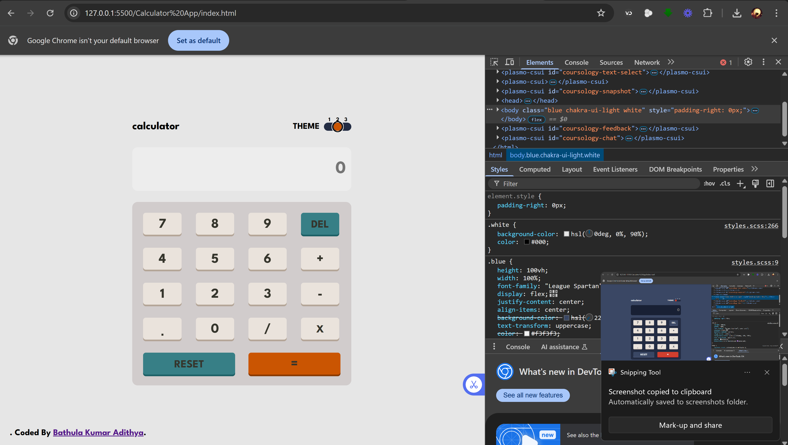
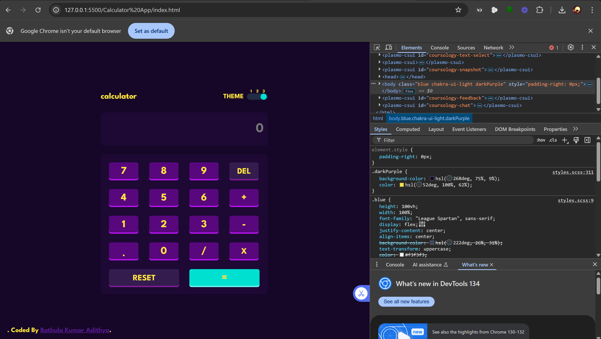

# Calculator App

A responsive calculator app that allows users to perform basic mathematical operations and customize the theme based on their preferences.

## Table of Contents

- [Overview](#overview)
  - [The challenge](#the-challenge)
  - [Screenshots](#screenshots)
  - [Links](#links)
- [My Process](#my-process)
  - [Built With](#built-with)
  - [What I Learned](#what-i-learned)
  - [Future Improvements](#future-improvements)
  - [Resources](#resources)
- [Author](#author)

## Overview

### The challenge

Users should be able to:

- See the size of the elements adjust based on their device's screen size
- Perform mathematical operations like addition, subtraction, multiplication, and division
- Adjust the color theme based on their preference
- **Bonus**: Have their initial theme preference checked using `prefers-color-scheme` and have any additional changes saved in the browser

### Screenshots





### Links

- **Solution URL**: [Add solution URL here]
- **Live Site URL**: [Add live site URL here]

## My Process

### Built With

- Semantic HTML5
- CSS custom properties
- Flexbox and CSS Grid
- Desktop-first workflow
- JavaScript

### What I Learned

- Implemented a three-state toggle button for theme switching.
- Enhanced understanding of responsive design and browser storage for theme preferences.

```css
.radio {
  display: flex;
  justify-content: center;
  align-items: center;
  flex-direction: column;
  gap: 0.5rem;

  input[name="toggle"] {
    appearance: none;
    border-radius: 50%;
    opacity: 0;
    width: 15px;
    height: 15px;
  }

  input[name="toggle"]:hover {
    cursor: pointer;
  }

  #one {
    opacity: 1;
    background-color: hsl(6, 63%, 50%);
  }

  #two {
    background-color: hsl(25, 98%, 40%);
  }

  #three {
    background-color: hsl(176, 100%, 44%);
  }

  label {
    font-size: 10px;
  }

  > label {
    position: absolute;
    top: 0;
  }
}

### Continued development

I'll keep pushing myself to becoming better at programming. I really love programming, I don't ever regret the day I made the decision to join.

### Useful resources

- Resource - This helped me in the implementation of the three state toggle section used for toggling the theme of the webpage

## Author

[Author](https://kumaradithya123.netlify.app/)
```
